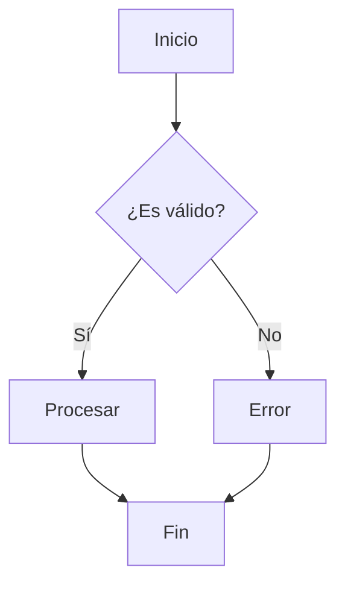
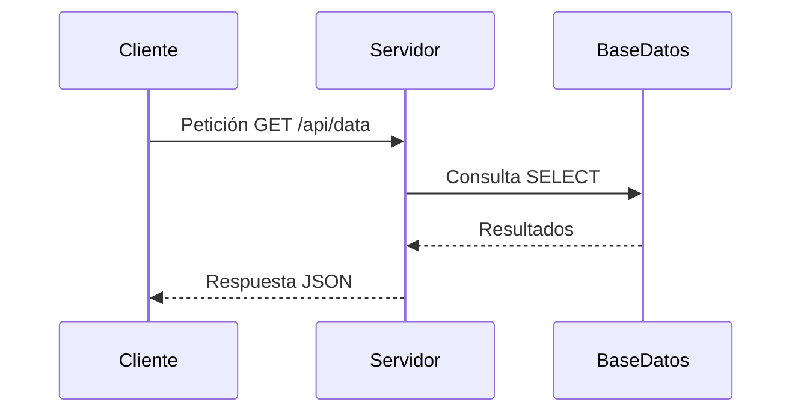
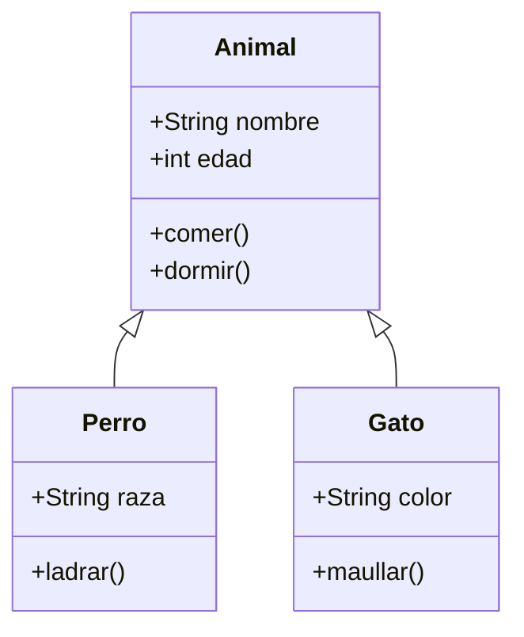
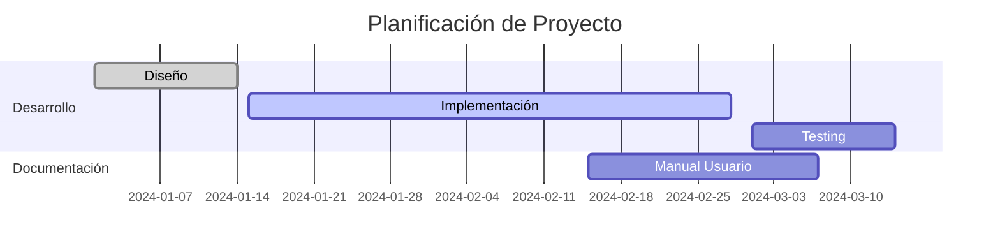

# 📘 Página de Ejemplo Markdown Extensa

## 📑 Tabla de Contenidos
1. [Encabezados](#-encabezados)
2. [Formato de Texto](#-formato-de-texto)
3. [Listas](#-listas)
4. [Enlaces e Imágenes](#-enlaces-e-imágenes)
5. [Tablas](#-tablas)
6. [Citas y Notas](#-citas-y-notas)
7. [Bloques de Código](#-bloques-de-código)
8. [Elementos Interactivos](#-elementos-interactivos)
9. [Matemáticas](#-matemáticas)
10. [Diagramas](#-diagramas)

---

## 🎯 Encabezados

# Encabezado H1
## Encabezado H2
### Encabezado H3
#### Encabezado H4
##### Encabezado H5
###### Encabezado H6

---

## ✨ Formato de Texto

**Texto en negrita**  
*Texto en cursiva*  
***Texto en negrita y cursiva***  
~~Texto tachado~~  
`Texto en línea de código`  
==Texto resaltado==  
Texto<sub>subíndice</sub>  
Texto<sup>superíndice</sup>

> 💡 **Nota:** Algunos formatos como ==resaltado== requieren extensiones específicas.

---

## 📋 Listas

### Lista Ordenada
1. Primer elemento
2. Segundo elemento
   1. Subelemento 2.1
   2. Subelemento 2.2
3. Tercer elemento

### Lista Desordenada
- Elemento A
- Elemento B
  - Subelemento B1
  - Subelemento B2
- Elemento C

### Lista de Tareas
- [x] Tarea completada
- [ ] Tarea pendiente
- [ ] Otra tarea pendiente

### Lista de Definición
HTML
: Lenguaje de marcado para la web

CSS
: Lenguaje de estilos para la web

JavaScript
: Lenguaje de programación para interactividad web

---

## 🔗 Enlaces e Imágenes

### Enlaces
[Enlace a Google](https://www.google.com)  
[Enlace con título](https://www.github.com "GitHub")  
[Enlace de referencia][1]  
[Enlace automático](https://www.markdownguide.org)

[1]: https://www.example.com

### Imágenes


### Imágenes con Enlace


---

## 📊 Tablas

### Tabla Básica

| Nombre | Edad | Ciudad |
|--------|------|--------|
| Juan   | 25   | Madrid |
| María  | 30   | Barcelona |
| Pedro  | 22   | Valencia |

### Tabla con Alineación

| Producto | Precio | Cantidad |
|:---------|:------:|---------:|
| Laptop   | €999   | 5        |
| Mouse    | €25    | 20       |
| Teclado  | €75    | 15       |

### Tabla Compleja

| Lenguaje | Paradigma | Popularidad | Año |
|----------|-----------|-------------|-----|
| Python | Multiparadigma | ⭐⭐⭐⭐⭐ | 1991 |
| JavaScript | Multiparadigma | ⭐⭐⭐⭐⭐ | 1995 |
| Rust | Sistemas | ⭐⭐⭐⭐ | 2010 |

---

## 💬 Citas y Notas

> Esta es una cita en bloque.
> Puede contener múltiples líneas.
>
> — Autor Desconocido

> ### Cita con formato
> 
> **Markdown** es un lenguaje de marcado ligero creado por *John Gruber*.
> 
> ```markdown
> # Ejemplo de código en cita
> ```

---

## 💻 Bloques de Código

### JavaScript
```javascript
// Función de Fibonacci recursiva
function fibonacci(n) {
    if (n <= 1) return n;
    return fibonacci(n - 1) + fibonacci(n - 2);
}

// Arrow function con map
const numbers = [1, 2, 3, 4, 5];
const squares = numbers.map(n => n * n);

// Clase ES6
class Person {
    constructor(name, age) {
        this.name = name;
        this.age = age;
    }
    
    greet() {
        return `Hola, soy ${this.name}`;
    }
}
```

### Python
```python
def factorial(n: int) -> int:
    """Calcula el factorial de un número."""
    if n == 0:
        return 1
    else:
        return n * factorial(n - 1)

# List comprehension
numbers = [1, 2, 3, 4, 5]
even_squares = [x**2 for x in numbers if x % 2 == 0]

# Decorador
def timer(func):
    import time
    def wrapper(*args, **kwargs):
        start = time.time()
        result = func(*args, **kwargs)
        end = time.time()
        print(f"Tiempo ejecución: {end - start:.2f}s")
        return result
    return wrapper

@timer
def slow_function():
    time.sleep(2)
```

### Java
```java
public class Main {
    public static void main(String[] args) {
        System.out.println("¡Hola, Mundo!");
        
        List<String> nombres = Arrays.asList("Ana", "Luis", "Maria");
        nombres.stream()
               .filter(n -> n.startsWith("A"))
               .forEach(System.out::println);
    }
    
    // Interfaz funcional
    @FunctionalInterface
    interface Calculadora {
        int operacion(int a, int b);
    }
    
    public static int calcular(int x, int y, Calculadora calc) {
        return calc.operacion(x, y);
    }
}
```

### C++
```cpp
#include <iostream>
#include <vector>
#include <algorithm>

using namespace std;

// Template function
template<typename T>
T maximo(T a, T b) {
    return (a > b) ? a : b;
}

// Lambda expressions
auto main() -> int {
    vector<int> numeros = {5, 2, 8, 1, 9};
    
    sort(numeros.begin(), numeros.end(), 
         [](int a, int b) { return a > b; });
    
    for(const auto& num : numeros) {
        cout << num << " ";
    }
    
    return 0;
}

// Smart pointers
class Recurso {
public:
    Recurso() { cout << "Recurso creado\n"; }
    ~Recurso() { cout << "Recurso destruido\n"; }
};
```

### HTML
```html
<!DOCTYPE html>
<html lang="es">
<head>
    <meta charset="UTF-8">
    <meta name="viewport" content="width=device-width, initial-scale=1.0">
    <title>Mi Página Web</title>
    <style>
        .container {
            max-width: 1200px;
            margin: 0 auto;
            padding: 20px;
        }
        
        @media (max-width: 768px) {
            .container {
                padding: 10px;
            }
        }
    </style>
</head>
<body>
    <div class="container">
        <header>
            <h1>Bienvenido</h1>
            <nav>
                <ul>
                    <li><a href="#inicio">Inicio</a></li>
                    <li><a href="#acerca">Acerca de</a></li>
                </ul>
            </nav>
        </header>
        
        <main>
            <article>
                <h2>Artículo Principal</h2>
                <p>Contenido interesante...</p>
            </article>
        </main>
    </div>
    
    <script>
        document.addEventListener('DOMContentLoaded', function() {
            console.log('Página cargada');
        });
    </script>
</body>
</html>
```

### CSS
```css
/* Variables CSS */
:root {
    --primary-color: #3498db;
    --secondary-color: #2ecc71;
    --font-size: 16px;
}

/* Flexbox layout */
.container {
    display: flex;
    flex-direction: column;
    gap: 1rem;
    padding: 2rem;
}

.card {
    background: white;
    border-radius: 8px;
    box-shadow: 0 2px 10px rgba(0, 0, 0, 0.1);
    padding: 1.5rem;
    transition: transform 0.3s ease;
}

.card:hover {
    transform: translateY(-5px);
}

/* Grid layout */
.grid-container {
    display: grid;
    grid-template-columns: repeat(auto-fit, minmax(250px, 1fr));
    gap: 1rem;
}

/* Animaciones */
@keyframes fadeIn {
    from {
        opacity: 0;
        transform: translateY(20px);
    }
    to {
        opacity: 1;
        transform: translateY(0);
    }
}

.animated {
    animation: fadeIn 0.5s ease-out;
}
```

### SQL
```sql
-- Creación de tabla
CREATE TABLE usuarios (
    id INT PRIMARY KEY AUTO_INCREMENT,
    nombre VARCHAR(100) NOT NULL,
    email VARCHAR(255) UNIQUE NOT NULL,
    fecha_registro DATETIME DEFAULT CURRENT_TIMESTAMP,
    activo BOOLEAN DEFAULT TRUE
);

-- Inserción de datos
INSERT INTO usuarios (nombre, email) 
VALUES 
    ('Ana García', 'ana@email.com'),
    ('Luis Martínez', 'luis@email.com');

-- Consulta con JOIN
SELECT 
    u.nombre,
    p.titulo,
    p.fecha_publicacion
FROM usuarios u
INNER JOIN posts p ON u.id = p.autor_id
WHERE p.fecha_publicacion > '2024-01-01'
ORDER BY p.fecha_publicacion DESC;

-- Función almacenada
DELIMITER //
CREATE PROCEDURE obtener_usuarios_activos()
BEGIN
    SELECT * FROM usuarios WHERE activo = TRUE;
END //
DELIMITER ;
```

### Bash/Shell
```bash
#!/bin/bash

# Script de backup automatizado
BACKUP_DIR="/home/user/backups"
DATE=$(date +%Y%m%d_%H%M%S)
LOG_FILE="/var/log/backup.log"

# Función para logging
log_message() {
    echo "$(date): $1" >> "$LOG_FILE"
}

# Crear directorio de backup
mkdir -p "$BACKUP_DIR"

# Backup de base de datos
backup_database() {
    local db_name="$1"
    local backup_file="$BACKUP_DIR/${db_name}_${DATE}.sql"
    
    if mysqldump -u root -p"$DB_PASSWORD" "$db_name" > "$backup_file"; then
        log_message "Backup de $db_name completado: $backup_file"
        # Comprimir backup
        gzip "$backup_file"
    else
        log_message "ERROR: Falló backup de $db_name"
        exit 1
    fi
}

# Ejecutar backup
backup_database "mi_base_datos"
```

### TypeScript
```typescript
interface User {
    id: number;
    name: string;
    email: string;
    age?: number;
}

class UserService {
    private users: User[] = [];
    
    // Método genérico con tipo
    addUser<T extends User>(user: T): void {
        this.users.push(user);
    }
    
    // Función asíncrona
    async fetchUsers(): Promise<User[]> {
        try {
            const response = await fetch('/api/users');
            const users: User[] = await response.json();
            return users;
        } catch (error) {
            console.error('Error fetching users:', error);
            return [];
        }
    }
    
    // Usando generics
    filterUsers<T extends keyof User>(
        users: User[], 
        key: T, 
        value: User[T]
    ): User[] {
        return users.filter(user => user[key] === value);
    }
}

// Tipo unión y intersección
type Admin = User & { permissions: string[] };
type UserRole = 'admin' | 'user' | 'guest';
```

### Rust
```rust
use std::collections::HashMap;
use std::fmt;

// Struct y implementación
#[derive(Debug)]
struct Point {
    x: f64,
    y: f64,
}

impl Point {
    fn new(x: f64, y: f64) -> Self {
        Point { x, y }
    }
    
    fn distance(&self, other: &Point) -> f64 {
        ((self.x - other.x).powi(2) + (self.y - other.y).powi(2)).sqrt()
    }
}

// Trait
trait Area {
    fn area(&self) -> f64;
}

impl Area for Point {
    fn area(&self) -> f64 {
        0.0
    }
}

// Pattern matching
fn process_result(result: Result<i32, String>) {
    match result {
        Ok(value) => println!("Valor: {}", value),
        Err(e) => println!("Error: {}", e),
    }
}

// Async/await
async fn fetch_data(url: &str) -> Result<String, reqwest::Error> {
    let response = reqwest::get(url).await?.text().await?;
    Ok(response)
}
```

### Go
```go
package main

import (
    "encoding/json"
    "fmt"
    "net/http"
    "sync"
)

// Struct con tags JSON
type User struct {
    ID       int    `json:"id"`
    Name     string `json:"name"`
    Email    string `json:"email"`
    Password string `json:"-"`
}

// Método receiver
func (u User) String() string {
    return fmt.Sprintf("User{ID: %d, Name: %s}", u.ID, u.Name)
}

// Goroutine con channel
func processUsers(users []User, results chan<- string, wg *sync.WaitGroup) {
    defer wg.Done()
    
    for _, user := range users {
        results <- fmt.Sprintf("Procesado: %s", user.Name)
    }
}

// HTTP handler
func userHandler(w http.ResponseWriter, r *http.Request) {
    users := []User{
        {ID: 1, Name: "Alice", Email: "alice@example.com"},
        {ID: 2, Name: "Bob", Email: "bob@example.com"},
    }
    
    w.Header().Set("Content-Type", "application/json")
    json.NewEncoder(w).Encode(users)
}

func main() {
    http.HandleFunc("/users", userHandler)
    http.ListenAndServe(":8080", nil)
}
```

---

## 🎮 Elementos Interactivos

### Detalles y Resumen
<details>
<summary>Haz clic para expandir</summary>

Este contenido está oculto inicialmente. Puedes usar esto para información adicional o secciones largas que no quieres mostrar inmediatamente.

```javascript
console.log("Código dentro de detalles");
```
</details>

---

## 📐 Matemáticas (con LaTeX)

### Fórmulas en Línea
La ecuación de Einstein: $E = mc^2$  
Teorema de Pitágoras: $a^2 + b^2 = c^2$

### Fórmulas en Bloque
$$
\int_{-\infty}^{\infty} e^{-x^2} dx = \sqrt{\pi}
$$

### Álgebra Lineal
$$
A = \begin{bmatrix}
a_{11} & a_{12} & \cdots & a_{1n} \\
a_{21} & a_{22} & \cdots & a_{2n} \\
\vdots & \vdots & \ddots & \vdots \\
a_{m1} & a_{m2} & \cdots & a_{mn}
\end{bmatrix}
$$

### Física Cuántica
$$
\psi(x,t) = \frac{1}{\sqrt{2\pi\hbar}} \int_{-\infty}^{\infty} \phi(p) e^{i(px - Et)/\hbar} dp
$$

---

## 📊 Diagramas (Mermaid)

### Diagrama de Flujo


### Diagrama de Secuencia


### Diagrama de Clases


### Gráfico de Gantt


---

## 🏁 Conclusión

Esta página demuestra la mayoría de los elementos disponibles en **Markdown**, incluyendo:

- ✅ **Sintaxis básica** (encabezados, listas, formato)
- ✅ **Elementos avanzados** (tablas, citas, notas al pie)
- ✅ **Bloques de código** con syntax highlighting
- ✅ **Elementos interactivos** (detalles/resumen)
- ✅ **Matemáticas** con LaTeX
- ✅ **Diagramas** con Mermaid

> **Nota:** Algunas funcionalidades como diagramas Mermaid y fórmulas matemáticas requieren soporte específico del renderizador Markdown.

---

*Última actualización: ${new Date().toLocaleDateString()}*
